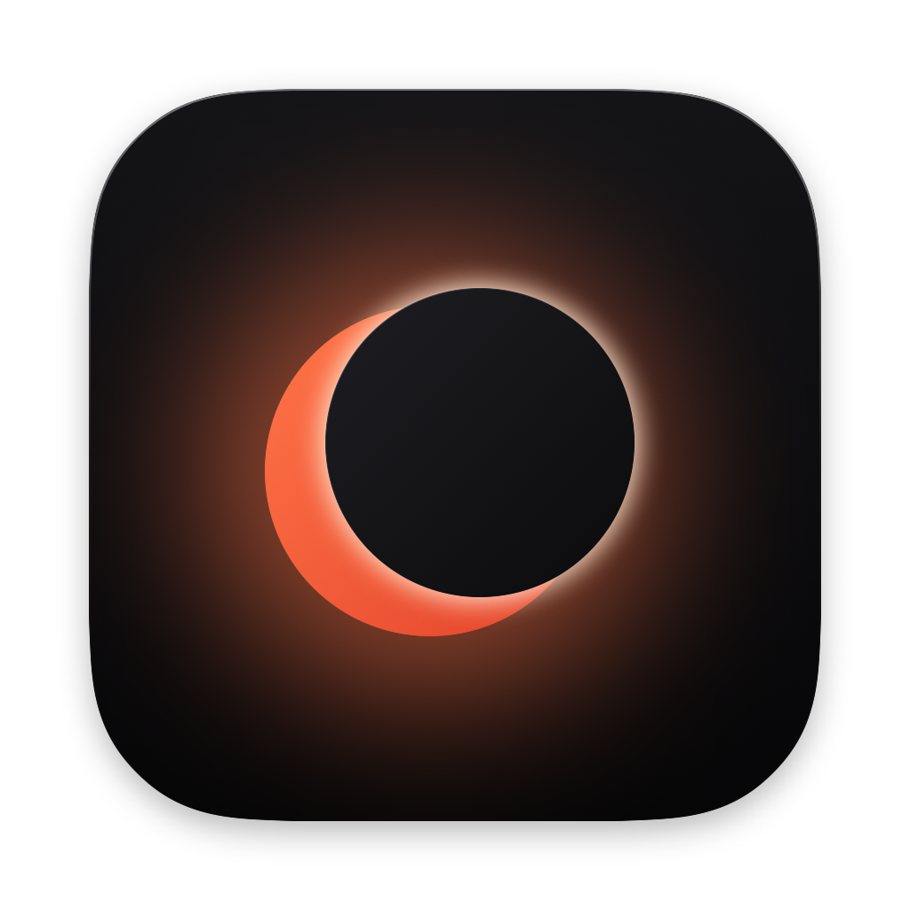
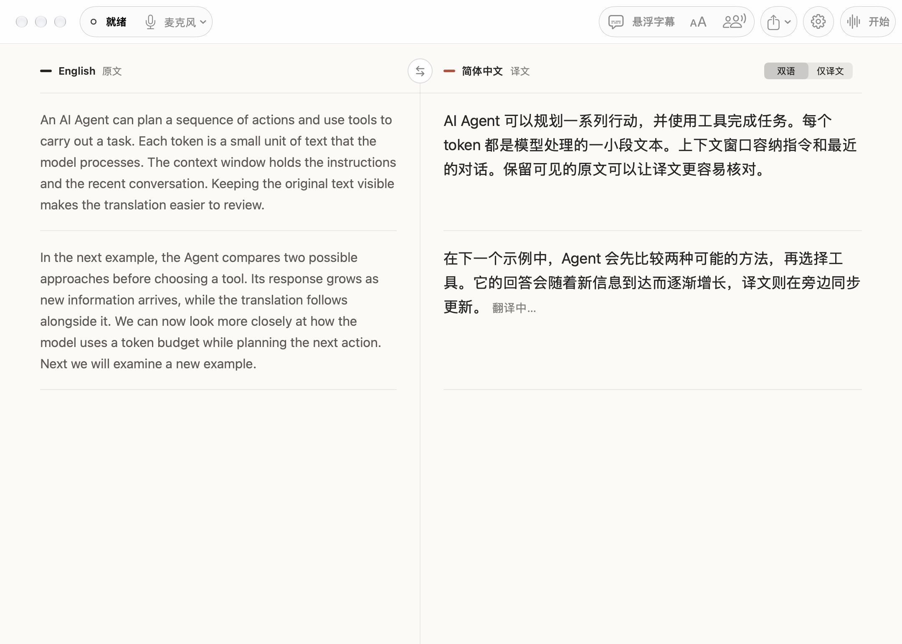
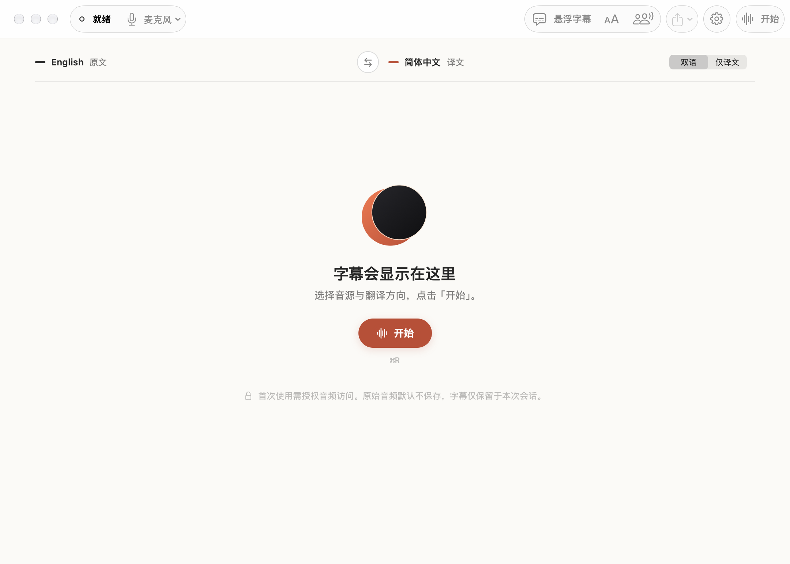
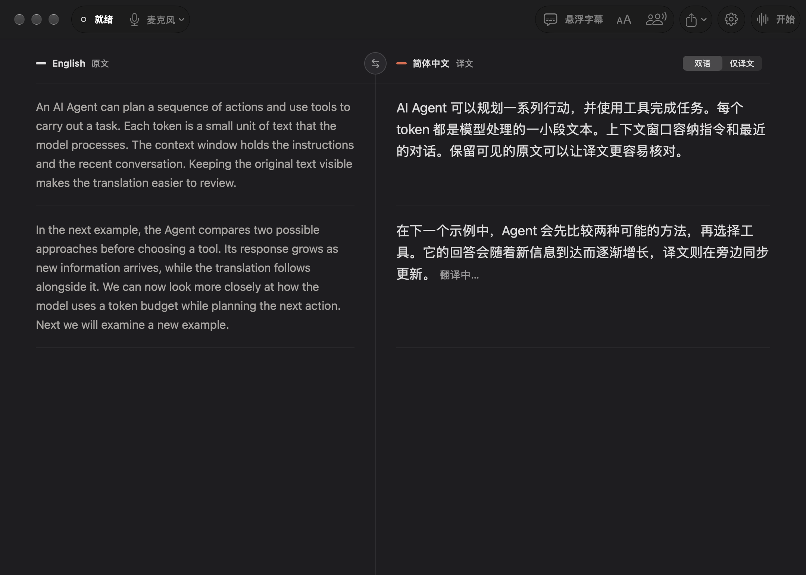
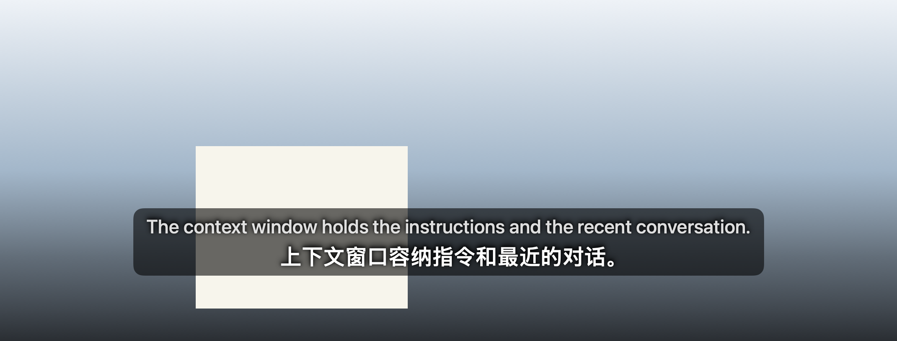
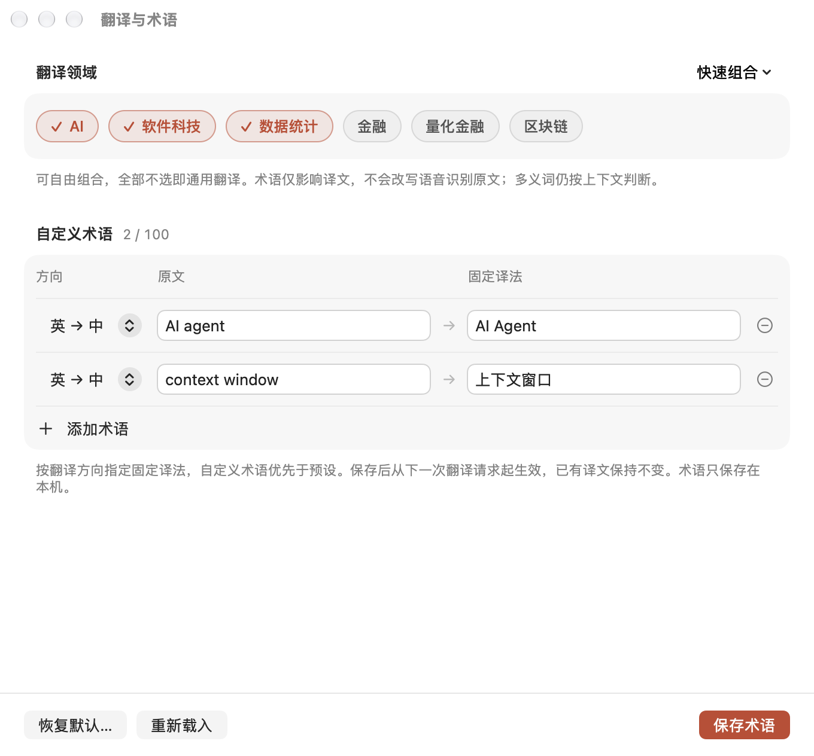

<p align="center">
  
</p>

<h1 align="center">LiveSub</h1>

<p align="center">
  <b>为 Mac 上听到的任何声音，配上实时双语字幕。</b><br>
  中英互译，边说边出现在屏幕上——私密、快速，而且免费。
</p>

<p align="center">
  <a href="https://github.com/Cis-jujube/LiveSub/releases/download/v0.1.1/LiveSub-0.1.1.dmg"></a>
</p>

<p align="center">
  <sub>版本 0.1.1 · 18 MB · macOS 15 或更新</sub><br>
  <sub><b>仅支持搭载 Apple 芯片（M1、M2、M3、M4 及更新机型）的 Mac，不支持 Intel Mac。</b></sub><br>
  <sub><a href="README.md">English</a> · <a href="#开始之前">开始之前</a> · <a href="https://github.com/Cis-jujube/LiveSub/releases">所有版本</a></sub>
</p>

<br>



## LiveSub 能为你做什么

- **看懂任何视频、网课和会议。** LiveSub 听取你的麦克风或 Mac 正在播放的声音，边说边生成中英字幕。
- **两种语言并排对照。** 原文和译文按段落一一对齐。点 ⇄ 切换翻译方向，也可以只看译文。
- **字幕浮在任何窗口之上。** 悬浮字幕盖在视频或通话上方，却不碍事：透明、鼠标可穿透、从不抢焦点。字号和位置随你调整，画面太亮时可以打开柔和的字幕底板。
- **快。** 在较新的 macOS 上，一句英文识别出来后约 21 毫秒就变成中文。
- **私密。** 收听、识别和翻译全部在你的 Mac 上完成。音频从不离开你的电脑；除非你导出，什么都不会保存。
- **用对专业词。** 打开 AI、软件科技、数据统计、金融、量化金融或区块链词库，还能添加最多 100 条你自己的术语。
- **留下重要内容。** 一键复制全部，或保存为包含双语的文本 / Markdown 文件。

| 第一次打开 | 深色模式 |
|---|---|
|  |  |
| **悬浮在视频上的字幕** | **词库与自定义术语** |
|  |  |

<sub>截图为真实 App 界面，字幕内容为示例文本。App 界面语言为中文。</sub>

## 开始之前

| | 你需要知道的 |
|---|---|
| **你的 Mac** | 搭载 **Apple 芯片**（M1、M2、M3、M4 及更新机型）、运行 **macOS 15 或更新版本** 的 Mac。不支持 Intel Mac。不确定？打开苹果菜单 →「关于本机」，看「芯片」一栏是否为「Apple M…」。 |
| **可用空间** | 约 **10 GB**。 |
| **一次性下载** | 第一次打开 LiveSub 时，它会下载语音识别和翻译模型：约 **8.6 GB**，只需一次。之后可以离线使用。 |
| **第一次打开** | LiveSub 是免费软件，没有经过 Apple 公证，所以 macOS 会请你用 **仍要打开** 确认一次。 |
| **第一次开始** | 第一次点「开始」时，LiveSub 需要 **一两分钟** 加载模型。之后启动会快很多。 |

## 快速上手

**1. 安装。** 点上方的 **下载 Mac 版**。打开下载好的 `LiveSub-0.1.1.dmg`，把 **LiveSub** 拖进 **应用程序**。

**2. 第一次打开 LiveSub。** 在「应用程序」里双击 LiveSub。如果 macOS 提示无法验证开发者：

- 点 **完成**。
- 打开 **系统设置 → 隐私与安全性**，向下滚动到关于 LiveSub 的提示。
- 点 **仍要打开**，再点 **打开**。

只需要做这一次。

**3. 下载模型。** LiveSub 会显示欢迎页。点 **开始下载**。进度条会告诉你还剩多少、大约还要多久，下载时你可以照常使用 Mac。如果下载中断，重新打开 LiveSub，它会从中断处继续。在中国大陆，LiveSub 会自动切换到国内镜像。

**4. 开始收听。** 选择 **麦克风** 或 **系统音频**（Mac 正在播放的声音），然后点 **开始**。macOS 询问是否允许使用麦克风或录制系统音频时，请允许。第一次开始需要一两分钟；之后只要有人说话，字幕就会出现。

## 使用 LiveSub

- **切换翻译方向：** 点栏目上方的 ⇄，选择英译中或中译英。
- **只看译文：** 在阅读区右上角选择 **仅译文**。
- **把字幕放到其他窗口上：** 点 **悬浮字幕**。在 **字幕外观** 里调整字号、移动位置或打开 **字幕底板**；调整好后在字幕上点 **完成**。
- **往回看也不会跟丢：** 随时向上滚动。点 **回到实时** 回到最新一句。
- **暂停、继续和停止：** ⌘R 暂停或继续，⌘. 停止。
- **保存这一段：** **导出** 菜单可以复制全部，或保存为文本 / Markdown 文件。
- **教它你的专业词：** 打开 **设置**（⌘,），打开词库、添加你自己的固定译法。新术语从下一句开始生效。

菜单栏里的 LiveSub 图标同样可以开始、暂停、显示悬浮字幕和调整字号。

## 有多快？

在 Apple M5 Pro 上，用公开与合成测试音频实测。计时从语音被识别成文字开始，不包含采集声音和在屏幕上绘制的时间。

| 环节 | 用时 |
|---|---|
| 使用 Apple 内置离线翻译，英译中（macOS 26.4 或更新，174 句） | 通常约 **21 毫秒**，慢的时候 35 毫秒 |
| 同样的翻译在 App 里处理连续音频（47 次翻译） | 通常约 **36 毫秒**，每一次都低于 300 毫秒 |
| 使用 LiveSub 自带的 Qwen 模型翻译（任何支持的 macOS） | 通常约 **225 毫秒** |
| 从开始说话到第一条译文字幕出现 | 约 **1.2 秒** |
| 有人说话时，实时原文多久刷新一次 | 约每 **0.8 秒** |

方法与原始数据：[翻译第四轮](docs/native-translation-round4-2026-10-03.md)和[第二轮](docs/english-chinese-round2-2026-10-03.md)。

## 你的隐私

- 收听、识别和翻译全部在你的 Mac 上进行。LiveSub 的各部分只在本机 `127.0.0.1` 上相互通信。
- 你的音频从不被录制或保存。字幕只保存在当前会话的内存里，直到你导出。
- 收听系统音频时，LiveSub 不会录制你的屏幕画面。
- 完成一次性的模型下载后，LiveSub 不联网也能使用。

## 遇到问题

**macOS 提示 LiveSub「无法打开」或「无法验证开发者」。** 没有经过公证的免费软件都会这样。按上面第 2 步操作：系统设置 → 隐私与安全性 → **仍要打开**。

**模型下载很慢或停住了。** 点 **重试**，已下载的部分都会保留。在中国大陆，LiveSub 会自动使用国内镜像。请确认还有约 10 GB 可用空间。

**没有出现字幕。** 确认 LiveSub 已获得权限：打开 系统设置 → 隐私与安全性 → **麦克风**（使用麦克风时）或 **屏幕与系统音频录制**（收听 Mac 正在播放的声音时），打开 LiveSub，然后退出并重新打开它。部分受保护的媒体无法采集。

**点了开始，等了很久。** 安装后第一次开始需要从头加载模型，可能要一两分钟。之后会快很多。

**可以在 Intel Mac 上使用吗？** 不可以。LiveSub 需要 Apple 芯片（M1 或更新）。

**怎样卸载 LiveSub？** 退出 LiveSub，把它从「应用程序」拖到废纸篓，再删除文件夹 `~/Library/Application Support/LiveSub`（约 8.6 GB 的模型）。在访达中选择「前往 → 前往文件夹…」，粘贴这个路径即可。

## 写在后面

LiveSub 是一个免费的个人项目，还在持续完善。日常场景的准确率、多人对话、超长时间使用以及多显示器上的悬浮字幕仍在测试中。已知问题见 [docs/known-issues.md](docs/known-issues.md)。

---

## 开发者信息

### 语音识别模型

LiveSub 的语音转文字一直在本地模型上运行。最初的版本使用网易有道的 **Confucius4-R2T2**，每 160 毫秒增量解码一次音频。在同一台机器、同一批音频的对比中，**Qwen3-ASR-1.7B** 更稳定地保住了技术和金融关键术语，因此成为现在默认的识别引擎。R2T2 的适配器和基准脚本仍保留在仓库中，供对比使用。

| 引擎（本地运行，同一批音频） | 合计错误率 |
|---|---:|
| Qwen3-ASR-1.7B（当前） | **1.32%** |
| Confucius4-R2T2 Q4 | 3.97% |
| Whisper large-v3-turbo | 6.62% |

样本较少，包含一段真人录音和四段合成语音，不代表通用准确率。详见[识别模型对比](docs/asr-model-comparison.md)。翻译使用 Qwen3-4B-Instruct（MLX 4-bit），在 macOS 26.4+ 且装有语言包时，英译中使用 Apple 离线翻译。模型来源、版本与哈希见[模型清单](docs/model-manifest.md)。

### 从源码构建

需要 Xcode Command Line Tools（含 Swift）与 [uv](https://docs.astral.sh/uv/)。macOS 把麦克风、屏幕与系统音频权限绑定在 App 的签名上，所以构建时需要一个固定的代码签名身份；在「钥匙串访问 → 证书助理」中创建的自签名「代码签名」证书即可。

```bash
git clone https://github.com/Cis-jujube/LiveSub.git && cd LiveSub
security find-identity -v -p codesigning        # 查看证书的 SHA-1
export LIVESUB_SIGNING_IDENTITY="<40 位十六进制 SHA-1>"
./script/setup_models.sh                        # 一次性：Python 环境、模型、签名 App
./script/build_and_run.sh --run                 # 构建并打开 dist/LiveSub.app
```

### 常用脚本

```bash
./script/test.sh                     # 后端测试、Swift 检查与调试构建
./script/build_and_run.sh --verify   # 构建并校验 release 版 .app，不打开
./script/package_release.sh          # 把 dist/LiveSub.app 打包成签名的拖拽安装 DMG
./script/render_design.sh            # 用示例文本渲染界面截图到 design/previews/
dist/LiveSub.app/Contents/MacOS/LiveSub --prepare-runtime   # 不打开窗口，直接运行首次安装
```

### 项目结构

| 目录 | 内容 |
|---|---|
| `app/LiveSub/MainWindow` · `App` | SwiftUI 主窗口、首次安装、设置、菜单栏与设计规范（`Theme.swift`） |
| `app/LiveSub/Overlay` | 透明、不激活、鼠标可穿透的悬浮字幕面板 |
| `app/LiveSub/Audio` | 麦克风与 ScreenCaptureKit 采集，转换为 16 kHz 单声道 PCM |
| `app/LiveSub/Subtitles` | 字幕存储、段落对齐、术语设置 |
| `app/LiveSub/Backend` | Python 子进程管理与本机 WebSocket 通信 |
| `backend/livesub` | Qwen3-ASR 识别、翻译调度、会话与字幕版本控制 |
| `shared/protocol.md` | 音频帧、状态与字幕事件协议 |
| `design/` | 设计方向、界面文案、QA 记录与图标方案 |

测试方法与数据见[人工测试矩阵](docs/manual-test-matrix.md)和[开发与验证记录](docs/development-log.md)。

## 许可证

LiveSub 的源代码以 [MIT 许可证](LICENSE) 发布。模型需单独下载，并遵循各自的许可证，见[模型清单](docs/model-manifest.md)。
